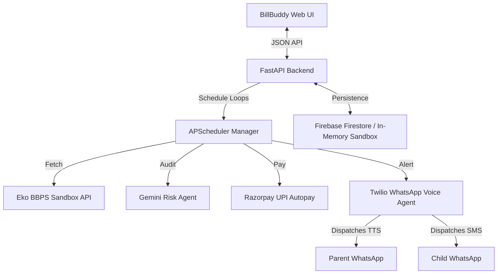

# BillBuddy
> **Autonomous Utility Coordinator & Safety Safeguards for Elderly Citizens**

BillBuddy is a premium web platform designed to help children manage, audit, and automate utility payments for their elderly parents. The system acts as a background coordinator that polls upcoming bills, executes risk-assessment checks (variance analysis), automates UPI Autopay settlement, and dispatches **spoken voice notes in regional languages** to parents via WhatsApp, alongside transactional text invoice confirmation to children.

---

## System Architecture



---

## Key Features

1. **Autonomous Execution Pipeline**: Daily scheduler loops through active profiles to coordinate utility checks without human intervention.
2. **LLM Risk Assessor**: Audits billing statements to detect anomalies (spikes in water/electricity/gas consumption) before triggering automated payment.
3. **Regional Voice Alerts**: Synthesizes spoken receipts (Hindi, Punjabi, Tamil, Telugu, English) using text-to-speech (TTS) and delivers them directly to parents' phones.
4. **Minimalist Setup Card Wizard**: Fully styled onboarding process allowing child configurations, linked operators, and UPI Autopay registration.
5. **Developer Logs Console Terminal**: Sleek control dashboard with a live agent connection heartbeat, terminal outputs, and clear log actions.

---

## 📁 Project Structure

```text
billbuddy/
├── backend/
│   ├── main.py              # FastAPI server entry point
│   ├── config.py            # Environment configurations & validation
│   ├── firebase_client.py   # Firebase Firestore & Sandbox persistent layers
│   ├── fetch_agent.py       # Eko BBPS integration & Mock billing routines
│   ├── risk_agent.py        # Gemini AI anomaly checking logic
│   ├── payment_agent.py     # Razorpay UPI Autopay simulations
│   ├── notify_agent.py      # Twilio WhatsApp voice/text notification engine
│   └── requirements.txt     # Python requirements
├── frontend/
│   ├── src/
│   │   ├── App.jsx          # React app routes, welcome, setup, dashboard views
│   │   ├── index.css        # Theme, glassmorphism UI styles, blink animations
│   │   └── main.jsx         # Vite bootstrapping
│   ├── package.json         # Node configurations
│   └── index.html           # Document template
└── .gitignore               # Block credentials from committing to Git
```

---

## Setup & Installation

### 1. Prerequisites
Ensure you have **Python 3.10+** and **Node.js 18+** installed on your system.

### 2. Backend Setup
1. Navigate to the backend directory:
   ```bash
   cd backend
   ```
2. Create and activate a virtual environment:
   ```bash
   python3 -m venv venv
   source venv/bin/activate
   ```
3. Install dependencies:
   ```bash
   pip install -r requirements.txt
   ```
4. Create a `.env` file from the example:
   ```bash
   cp .env.example .env
   ```
5. Populate the `.env` with your API credentials (see [Environment variables](#-environment-variables)).
6. Run the FastAPI development server:
   ```bash
   python -m uvicorn main:app --port 8000 --reload
   ```

### 3. Frontend Setup
1. Navigate to the frontend directory:
   ```bash
   cd ../frontend
   ```
2. Install npm packages:
   ```bash
   npm install
   ```
3. Run the development build:
   ```bash
   npm run dev
   ```
4. Open your browser and navigate to **`http://localhost:5173`**.

---

## Environment Variables

The backend requires a configured `.env` file with the following variables:

| Variable Name | Description | Source / Instructions |
|---|---|---|
| `PORT` | Port for FastAPI backend | Default is `8000`. |
| `FIREBASE_PROJECT_ID` | Project Identifier for database | Create a project in [Firebase Console](https://console.firebase.google.com/). |
| `FIREBASE_CREDENTIALS_JSON_PATH` | Path to Firebase private key JSON | Project Settings -> Service Accounts -> Generate Private Key. |
| `EKO_BBPS_API_KEY` | Developer Key for BBPS checks | Obtain sandbox key from [Eko Connect Portal](https://eko.in/). |
| `EKO_BBPS_DEVELOPER_ID` | Developer Partner ID | Obtained alongside Eko Sandbox developer key. |
| `RAZORPAY_KEY_ID` | Public Key ID for mandate setup | Register mode sandbox keys in [Razorpay Settings](https://razorpay.com/). |
| `RAZORPAY_KEY_SECRET` | Secret API credential for mandate | Generated alongside Razorpay public key ID. |
| `TWILIO_ACCOUNT_SID` | Twilio API Security identifier | Copy from [Twilio Console Homepage](https://console.twilio.com/). |
| `TWILIO_AUTH_TOKEN` | Twilio Account authorization token | Copy from Twilio Console Dashboard. |
| `TWILIO_WHATSAPP_NUMBER` | Sandbox sender phone number | WhatsApp sandbox number, e.g. `whatsapp:+14155238886`. |
| `GEMINI_API_KEY` | LLM Key for Anomaly Analysis | Generate key in [Google AI Studio](https://aistudio.google.com/). |

*Note: In sandbox/mock development, Eko and Firebase can run completely in-memory by setting `EKO_BBPS_API_KEY=mock_eko` and leaving `FIREBASE_CREDENTIALS_JSON_PATH` as a dummy value.*

---

## Sandbox Testing Guide

To test the application end-to-end locally without external network failures or database setup:

1. **Mock Modes**: Setting Eko keys to start with `mock_` disables external Eko queries and automatically builds local mock statement templates.
2. **Local public exposure (localtunnel)**: Twilio requires an internet-facing HTTPS URL to fetch generated spoken audio notes from your computer. Expose your server using:
   ```bash
   npx localtunnel --port 8000
   ```
3. **Configure PUBLIC_URL**: Copy the generated localtunnel link (e.g., `https://xxxx.loca.lt`) and set it in your `.env` file:
   ```env
   PUBLIC_URL=https://xxxx.loca.lt
   ```
4. **Trigger Loop**: Click the **"Trigger Orchestrator"** button inside the BillBuddy Dashboard panel to run the daily loop and verify Twilio WhatsApp dispatch outcomes in real-time.
